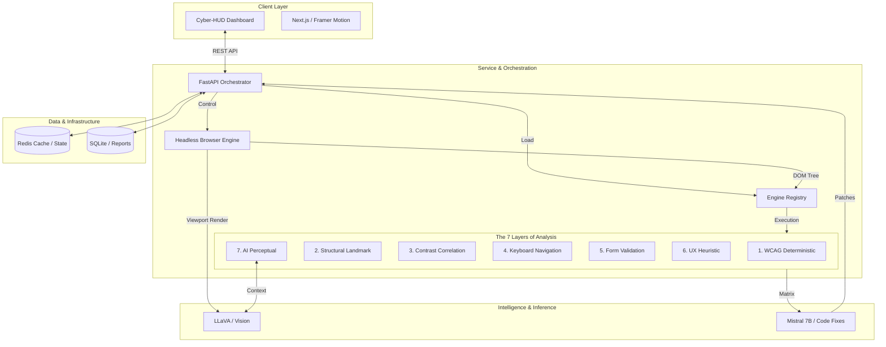

# AccessLens

*Bridges the gap between valid code and usable design by detecting real-world accessibility issues and generating fixes.*

[](https://opensource.org/licenses/MIT)
[](https://www.python.org/downloads/)
[](https://www.docker.com/)
[](https://github.com/Upanshi-Mittal/Accesslens)
[](https://accesslens-azure.vercel.app/)

---

## Table of Contents

- [The Problem](#the-problem)
- [Why It's Different](#why-its-different)
- [Live Application](#live-application)
- [Demo Video](#demo-video)
- [Quick Start](#quick-start)
- [What It Looks Like](#what-it-looks-like)
- [How It Works](#how-it-works)
- [Technical Stack](#technical-stack)
- [Project Metrics](#project-metrics)
- [Documentation](#documentation)
- [Development](#development)
- [Contributing](#contributing)
- [License](#license)

---

## The Problem

**Over 1 billion people** live with disabilities, yet much of the web remains inaccessible.

Traditional tools like Lighthouse and axe-core check code compliance but miss real user experience. They fail to detect:

| Issue | Example |
|-------|---------|
| **Confusing layouts** | Elements that visually overlap or have illogical reading order |
| **Poor contrast in dynamic states** | Buttons that become unreadable on hover or focus |
| **Non-descriptive content** | Images with no alt text, links that say "click here" |
| **Keyboard traps** | Users who cannot tab past a certain element |

**AccessLens solves this gap.** It detects real-world usability issues and generates actionable fixes—not just reports.

---

## Why It's Different

| Feature | Lighthouse / axe-core | Manual Expert Audit | **AccessLens** |
|---------|:---------------------:|:-------------------:|:--------------:|
| **Logic Scans (ARIA/DOM)** | Yes | Yes | Yes |
| **Visual Validation** | No | Yes | **Yes (Computer Vision)** |
| **Contextual Awareness** | No | Yes | **Yes (AI Reasoning)** |
| **Automated Code Fixes** | No | No | **Yes (Synthesized)** |
| **Visual HUD Mapping** | No | No | **Yes (Real-time)** |
| **Cost** | Free | Expensive | Free |
| **Speed** | Fast | Slow | Fast |

---

## Live Application

**[Live Application →](https://accesslens-azure.vercel.app/)** 

**[Backend API →](https://sansritimishra-accesslens-backend.hf.space/)**

> **Note:** The cloud demo blocks certain sites (YouTube, WhatsApp) due to platform security rules. For full functionality on all sites, [run locally](#quick-start) with `docker-compose up`.

---

## Demo Video

[](https://youtu.be/eLlvl_BwnY4)

---

## Quick Start

Get AccessLens running locally in three commands:

```bash
# 1. Clone the repository
git clone https://github.com/Upanshi-Mittal/Accesslens

# 2. Navigate to the project
cd Accesslens

# 3. Launch with Docker (recommended)
docker-compose up --build -d
```
Then open your browser to `http://localhost:3000`

The local engine has no restrictions—works on any site, including Shadow DOM-heavy applications.

### Requirements
- Docker Desktop (or Docker + Docker Compose)
- 8GB+ RAM recommended
- Keep at leat 5GB free for smooth functioning.

---

## What It Looks Like

| Cloud Analysis (Hugging Face) | Local Analysis (YouTube) |
| :---: | :---: |
|  |  |
| Works on most public sites | Full Shadow DOM piercing |

---

## How It Works

<details> <summary><strong>Seven Analysis Engines</strong></summary>
AccessLens executes seven specialized engines in parallel for a comprehensive audit:

| Engine | What It Detects | Technology |
| :--- | :--- | :--- |
| **1. WCAG Deterministic** | Industry-standard rule violations | `axe-core` |
| **2. Structural Heuristics** | Broken heading hierarchy, missing landmarks, ARIA misuse | Custom rules |
| **3. Contrast Correlation** | Color contrast issues across gradients and interactive states | Color math + Playwright |
| **4. Navigation & Forms** | Keyboard traps, missing tab order, unlabeled form fields | Tab simulation |
| **5. UX Heuristics** | Repetitive link text, complex reading levels | NLP analysis |
| **6. AI Perceptual** | Layout overlaps, visual contrast, generates alt-text | LLaVA vision model |
| **7. Code Remediation** | Generates React/HTML code patches with diffs | Mistral 7B LLM |
</details>

<details> <summary><strong>AI Models</strong></summary>

| Model | Purpose | Size |
| :--- | :--- | :--- |
| **LLaVA (Vision)** | Analyzes screenshots for layout issues, overlapping elements, generates semantic alt-text | 7B parameters |
| **Mistral 7B (Code)** | Converts violations into localized React/HTML patches with context-aware diffs | 7B parameters |
| **Sentence-Transformers** | Semantic similarity for detecting redundant content | 384-dim embeddings |

All models run locally. No API calls. No data leaves your machine.
</details>

<details> <summary><strong>System Architecture</strong></summary>


</details>

<details> <summary><strong>Data Flow</strong></summary>

1. **User enters URL** → Frontend sends request to FastAPI orchestrator
2. **Headless browser loads page** → Playwright renders and captures DOM + AX-Tree + screenshot
3. **Seven engines execute in parallel** → Each analyzes a different aspect
4. **LLaVA processes screenshot** → Detects visual layout issues
5. **Mistral 7B generates fixes** → Produces React/HTML patches
6. **Results aggregated** → Sent back to HUD for visualization
</details>

---

## Technical Stack

| Category | Technologies |
| :--- | :--- |
| **Frontend** | Next.js 14, Framer Motion, Tailwind CSS v4 |
| **Backend** | FastAPI, Playwright, Axe-Core |
| **Intelligence** | LLaVA (Vision), Mistral 7B (Code), Sentence-Transformers |
| **Infrastructure** | Docker , Redis, SQLite |
| **Testing** | 85% test coverage (pytest) |

---

## Project Metrics

| Metric | Value |
| :--- | :--- |
| **Test Coverage** | 85% |
| **Analysis Engines** | 7 parallel |
| **AI Models** | LLaVA + Mistral 7B |
| **Average Response Time** | ~232 ms |
| **Development Duration** | 23 days |
| **Total Commits** | 41 |
| **Lines of Code** | ~33,500 (excluding lockfiles) |

---

## Documentation

For detailed documentation on specific system components:

| Document | Description |
| :--- | :--- |
| [System Architecture](./docs/ARCHITECTURE.md) | High-level system flow, pipeline design, and infrastructure |
| [Backend Technical Guide](./docs/BACKEND.md) | Deep dive into the 7 analysis engines, orchestration, and persistent storage |
| [Frontend Design](./docs/FRONTEND.md) | HUD implementation, Framer Motion, Tailwind |
| [Backend API](./backend/API.md) | FastAPI endpoints, engine registry, Playwright integration |
| [Contributing Guide](./docs/CONTRIBUTING.md) | Contribution guidelines, code style, PR process |
| [Setup & Deployment](./docs/SETUP.md) | Detailed installation, environment variables, deployment |
| [Development Journey](./DEVELOPMENT.md) | Project evolution, challenges, and milestones |

---

## Development

### Local Development (without Docker)(kindly prefer Docker)

```bash
# Backend
cd backend
pip install -r requirements.txt
uvicorn main:app --reload

# Frontend
cd frontend
npm install
npm run dev
```

### Running Tests

```bash
cd backend
pytest --cov=. --cov-report=term-missing
# Coverage: 86%
```

### Building Docker Image

```bash
docker build -t accesslens .
```

---

## Contributing

Contributions are welcome. Please refer to the [Contributing Guide](./docs/CONTRIBUTING.md) for code style guidelines, PR process, and development setup.

---
## Acknowledgments

*   **axe-core** for WCAG compliance rules
*   **LLaVA** for vision-language model
*   **Mistral AI** for code generation model
*   **Playwright** for browser automation
*   **Built for Accessibility**
---

## License

This project is licensed under the MIT License. See the [LICENSE](./LICENSE.md) file for details.

---

## Security

For security concerns, please refer to the [Security Policy](./SECURITY.md).


