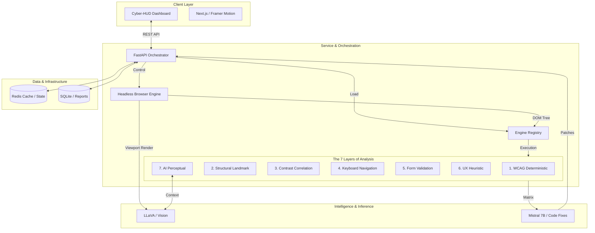

# AccessLens

*Bridges the gap between valid code and usable design by detecting real-world accessibility issues and generating fixes.*

---

## The Problem: The Accessibility Gap

There are over **1 billion people** worldwide living with disabilities. Despite the maturity of web standards, the majority of the digital landscape remains inaccessible due to a fundamental limitation in traditional tooling.

Standard tools (Lighthouse, axe-core) are **Structural Scanners**—they check for code compliance but are "blind" to the actual human experience. They cannot detect confusing layouts, insufficient contrast in dynamic states, or non-descriptive imagery that stops a user in their tracks.

**AccessLens was built to resolve this drawback.** It is an **AI-Driven Accessibility Layer** designed to bridge the gap between "valid code" and "usable design." The platform doesn't just find issues; it analyzes the **perceptual layer** using vision models and synthesizes localized remediations.

---

## System Capabilities

### 1. Multi-Engine Orchestration
AccessLens executes seven specialized engines in parallel to provide a comprehensive audit:
- **WCAG Deterministic**: Industry-standard rule validation using `axe-core`.
- **Structural Heuristics**: Analysis of semantic landmarks, heading hierarchy, and ARIA roles.
- **Contrast Correlation**: Precise measurement of color ratios across rendered gradients and interactive states.
- **Navigation & Forms**: Simulation of keyboard tab-order and form-label association logic.
- **UX Heuristics**: Detection of repetitive link text and content reading complexity.

### 2. Computer Vision Integration (LLaVA)
Utilizing the **LLaVA** vision model, AccessLens performs perceptual analysis on high-resolution viewport screenshots:
- **Layout Validation**: Detects overlapping elements or deceptive visual hierarchies.
- **Visual Contrast**: Validates contrast in complex, non-text UI elements.
- **Semantic Imagery**: Generates high-fidelity alternative text descriptions based on visual context.

### 3. AX-Tree Synchronization & Visualization
AccessLens extracts the browser's native **Accessibility Tree (AX-Tree)** and synchronizes it with the visual HUD. This allows developers to inspect how the browser represents the page to assistive technologies in real-time.

### 4. Automated Code Remediation (Mistral 7B)
Powered by **Mistral 7B**, the remediation engine converts detected violations into localized **React and HTML code patches**. It analyzes the surrounding DOM context to generate side-by-side diffs, simplifying the implementation of fixes.

---

## System Architecture

AccessLens follows a modular, layer-driven architecture designed for high-concurrency auditing and AI synthesis.

---

## Comparison Matrix

| Feature | Automated Scanners | Manual Expert Audit | **AccessLens** |
| :--- | :---: | :---: | :---: |
| **Logic Scans (ARIA/DOM)** | Yes | Yes | Yes |
| **Visual Validation** | No | Yes | **Yes (Computer Vision)** |
| **Contextual Awareness** | No | Yes | **Yes (AI Reasoning)** |
| **Automated Remediation** | No | No | **Yes (Synthesized)** |
| **Spatial HUD Mapping** | No | No | **Yes (Real-time)** |

---

## Technical Stack

| Category | Technologies |
| :--- | :--- |
| **Frontend** | Next.js 14, Framer Motion, Tailwind CSS v4 |
| **Backend** | FastAPI, Playwright, Axe-Core |
| **Intelligence** | LLaVA, Mistral 7B, Sentence-Transformers |
| **Infrastructure** | Docker, Redis, SQLite |

---

## Documentation

For deep-dive documentation on specific system components, visit the [Documentation Hub](./docs):
- [System Architecture & AI Pipelines](./docs/ARCHITECTURE.md)
- [Frontend Design & HUD Logic](./docs/FRONTEND.md)
- [Backend Engine Specifications](./docs/BACKEND.md)
- [Contributing Guide](./docs/CONTRIBUTING.md)
- [Setup & Deployment](./docs/SETUP.md)

---
##  Live Demo

- Live App: https://accesslens-azure.vercel.app/
- Backend API: https://sansritimishra-accesslens-backend.hf.space/
---
## Quick Start

1. **Clone**: `git clone https://github.com/Upanshi-Mittal/Accesslens`
2. **Launch**: `docker-compose up --build -d`
3. **Analyze**: Access the dashboard at `http://localhost:3000`

---

### [License](./LICENSE) | [Code of Conduct](./CODE_OF_CONDUCT.md) | [Security](./SECURITY.md)
